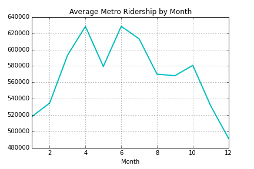
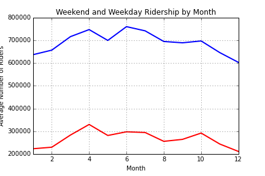
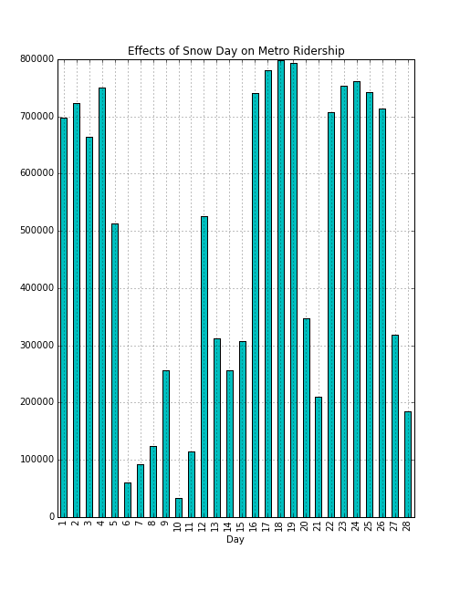
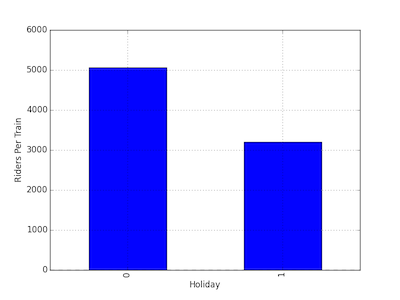
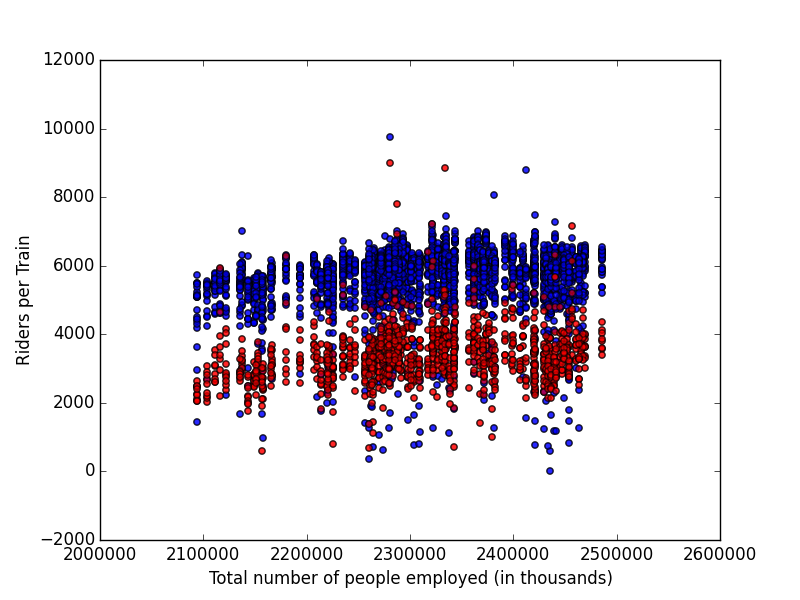

# Predicting Metrorail Ridership
##### Lena Nguyen - DAT 6 - May 2, 2015
---
## Project Goal
The [WMATA Metrorail](http://www.wmata.com) services the DC Metropolitan area, which include DC, Fairfax County and Loudon County in Northern Virginia, PG County and Montgomery County in Maryland. The ultimate goal of my project is to accurately forecast ridereship on the Metrorail.

## Data Overview and Sources
The majority of my time was spent thinking about factors that would affect metrorail ridership and where I would get the data I wanted. The process of gathering data involved a lot of searching around the internet for the most apporpriate and publicly available dataset to use. Gathering data for number of tourists proved to be the most challenging. All the data that were free were very aggragated. Since I suspected there is seasonal variation in tourism in DC, I decided not to use this data. I settled on using the Capital Bikeshare (CaBi) data as a proxy for tourism. However, this was also not a good proxy for tourism because it only went back to 2010 (when CaBi started in DC). 

#### Response Variable: Metrorail Riders per Train
I plan to use historic Metrorail ridership data to build and validate my model. Instead of using total riders, I used the number of riders per train as the response variable so that the response variable would be more standardized. Fewer trains run on the weekends and holidays. Conversely, more trains run on some holidays where WMATA thinks there will be more riders (ie July 4th). To construct the riders per train variable, I used data from two sources. 

I used the historic Metrorail Ridership from 2004 to 2014 available on Open Data DC also has [historic ridership data](http://www.opendatadc.org/dataset/wmata-metrorail-ridership-by-date). The number of trains per day was deduced from data about the [frequency of trains](http://www.wmata.com/rail/frequency.cfm). Adjustments in the number of trains were made based on information available on WMATA. In general, the Metrorail run on a Saturday schedule for most holidays so the number of trains were adjusted to the Saturday schedule for simplicity. The spreadsheet with the math can be found [here](http://www.wmata.com/rail/frequency.cfm)

#### Feature Variables
I used the following features in my model:
* Gas prices: When gas prices are low, people will choose to drive instead of using the metrorail. The US Energy Information Administration has [historic gas prices](http://www.eia.gov/dnav/pet/hist/LeafHandler.ashx?n=PET&s=EMM_EPMRR_PTE_R1Z_DPG&f=W) available in xls format for the every week from 1995 to present day for regions in the US. DC/MD/VA is part of the Lower Atlantic region.

* Weather: People will be less likely to use the metrorail during inclement weather. NOAA has historic [weather data](http://www.ncdc.noaa.gov/cdo-web/datatools) on their website. I used the weather data from the Reagan National Airport.

* DC employment figures: I hypothesize that the majority of people are using the metrorail to get to and from work so employment figures will have an impact on ridership. The US Bureau of Labor Statistics provide historical [labor force data](http://www.bls.gov/eag/eag.dc_washington_md.htm) for the Washington DC Metro area. 

* Capital Bikeshare (CaBi): The [trip history data](https://www.capitalbikeshare.com/trip-history-data) available on the Capital Bikeshare website was used to find the nubmer of Registtered and Casual riders everyday. Casual riders will serve as a proxy for tourist numbers in DC since many tourists use CaBi to get around the National Mall and other tourist areas. The major problem with using this data is that CaBi started in late 2010 so there will be 6 years worth of data where I will not have tourism data. 

* Federal holidays: Since the majority of people working in DC are employed by the federal government, closure of the federal government will have a large impact on ridership. Data for federal holidays can be found [here](https://catalog.data.gov/dataset/federal-holidays). The data was supplemented with historic status from [OPM](http://www.opm.gov/policy-data-oversight/snow-dismissal-procedures/status-archives/) to add closure days due to inclement weather and budgetary issues.

## Data Processing
All the datasets that I used were simple and already mostly clean.  I had to transform the date variable in each dataset to a standardardized format so that they could be merged into one large dataset. 

## Data Visualization
### Characteristics of Metrorail Ridership
##### Average Ridership By Month

We can see the seasonal differences in metrorail ridership in the above graph. Ridership is highest in the months of April and June. It is lowest in the winter months (December-February). I suspect that the monthly differences are due to: tourism and people in DC going on vacation. Since ridership varies vastly by month, I decided to use Month as a feature after transforming the categorical variable to several binary ones. 

##### Average Ridership by Day of the Week

We can see in the above graph that average metrorail ridership is significantly lower on weekends than weekdays. This supports my hypothesis that many people ride the metrorail to get to and from work. Additionally, the monthly variation in the weekday and weekend ridership have the same pattern so it appears other factors are affecting weekday and weekend ridership about the same. 

##### Effect of Inclemenet Weather on Metrorail Ridership

During February 6-15 2010, DC was hit hard by several blizzards causing an event more popularly known as Snowmageddon. Because of the large amount of snow, many offices (including the federal government) were closed during this time. The graph above shows that ridership is extremely low during the Snowmageddon days. This effect can also be seen when Hurricane Sandy hit DC at the end of October 2012. 

##### Scatter Matrix of Weather Variables and Ridership
.png)
The above scatter matrix shows the relationship of all the weather variables and ridership to each other. It is interesting to note the two groups in Ridership in max temperature (TMAX) and min temperatures (TMIN). The lower ridership group will be the weekend days and the higher ridership group will be the weekday days. Looking at the snow depth variable (SNWD), we can see that there is extremely low ridership when there is a large amount of snow on the ground. Precipation seeem to have no clear effect on ridership.

##### Holiday Effect

The variable with the most significant effect will be weather if the day was a holiday or not. Holiday ridership is on average 60% of the amount of regular day ridership. 

##### Employment

In the above graph, red is weekend days and blue is weekday days. The data points appear to be grouped in vertical lines because the ridership data is daily while employment data is at the monthly level. Number of people employed does appear to have a slight upward trend in the weekday obs but there relationship is not obvious. There appers to be no pattern between employment and weekend ridership.

## Outliers
Since a linear regression model is extremely sensitive to outliers, I had to identify and find ways to deal with outliers. To identify outliers, I standardized the Riders per Train variable into z-scores. The z-scores will show me how many standard deviations (SD) the value is from the mean. There were 16 observations that were +/- 3 SD away from the mean, out of a total of 4018 total observations. Luckily, this is less than 1% of the data so removing all these outliers would not greatly affect my sample size. From looking at the characteristics of the outliers, many of the outliers are Christmas Day or other major holidays. These days would naturally have very low ridership. From looking the characteristics of the outliers, I decided on trimming data points that were greater than +/- 3.5 SD away. This resulted in the removal of only two data points from the datset: October 39, 2012 (Metro completely closed for Hurricane Sandy) and January 19, 2009 (the day before Obama's first inaguaration).

## Modeling
#### Full dataset models (w/o binary days of the week variables)
Because my response variable is continuous and I wanted interpretable results from my model, I decided that the best model would be a linear regression. However,  I was curious about how a linear regression model would perform against other models, so I also fitted a random forest model and gradient boosting regressor model to the data. Although tree based models are good at dealing with outliers, I ran all three models on the same dataset since I only trimmed two outliers. Additionally, because I just wanted to observe the baseline performance of the models, I did not do any parameter tuning for any of the models. 

You can see in the table below that the Gradient Boosting Regressor model performs the best out of the four. Although the random forest also has the best R squared value for the dataset, it has starkly different values of R squared for the train (0.868) and test (0.267) datasets. The other models have fairly similar R squared values for both test and train data. The stark difference the R square values demonstrate that the random forest model is overfitting the train dataset while the other models are performing equally poorly with both train and test dataset.

| Model       								| CV RMSE   | R squared |
| ------------------------------------------|:---------:|:----------:
| Linear Regression (w/ feature selection)  | 1265.35 	| 0.143		|
| Linear Regression (w/o feature selection) | 1180.55	| 0.251		|
| Random Forest Regressor     				| 1146.71   | 0.696		|
| Gradient Boosting Regressor				| 1074.53  	| 0.430		|

#### Split Weekday/Weekend models
I hypothesized that the features have different effects on ridership during the weekend and weekday ridership, I decided to make two different models for weekend and weekday. For example, employment variables would have a huge effect on weekday ridership but a small effect on weekend ridership. Using the same features for both models might not make sense so I selected features based on p-values separately for the weekday and weekend data. 

I ran both a linear regression and gradient boosting model on the weekday and the weekend datasets. The two tables below shows the performance of the models for the weekdays and the weekends.

###### Weekday
| Model       								| CV RMSE   | R squared |
| ------------------------------------------|:---------:|:----------:
| Linear Regression (w/ feature selection)  | 749.19	| 0.455		|
| Linear Regression (w/o feature selection) | 721.20	| 0.475		|
| Gradient Boosting Regressor				| 617.17  	| 0.546		|

###### Weekend
| Model       								| CV RMSE   | R squared |
| ------------------------------------------|:---------:|:----------:
| Linear Regression (w/ feature selection)  | 662.37	| 0.366		|
| Linear Regression (w/o feature selection) | 608.55	| 0.444		|
| Gradient Boosting Regressor				| 604.65  	| 0.412		|

This split model performs much better than the model with the full dataset. The gradient boosting regressor model also performs better than the linear regression model with the weekday/weekend datasets. The improved performance of this models in this weekday/weekend split data led me to think to add days of the week as features into my full dataset model. 

#### Full dataset models (w/ binary days of the week variables)
With the addition of the binary variables of the days of the week as features, both RMSE and R squared for all the models improve astonishingly. The linear regression model benefited the most from the addition of these features. 

| Model       								| CV RMSE   | R squared |
| ------------------------------------------|:---------:|:----------:
| Linear Regression (w/ feature selection)  | 613.76 	| 0.793		|
| Linear Regression (w/o feature selection) | 581.80	| 0.821		|
| Random Forest Regressor     				| 529.16   	| 0.844		|
| Gradient Boosting Regressor				| 480.98  	| 0.871		|

Looking at the graph below of the residuals of the best performing model (Gradient Boosting Regressor) as an example, there does not appear to be a pattern in where the residuals are the largest. All the models suffer from the same random pattern of larger residuals being random, suggesting that there are factors affecting ridership that are not yet captured by the features.

###### Graph of Residuals of Gradient Boosting Regressor Model versus Predicted Values
.png)

## Challenges and Lessons Learned
* Finding publicly available and data processing data takes a significant amount of time. There were many times when I was searching for datasets, transforming data, or combining data where I wished I had done a kaggle competition instead. In the end,I did learn a lot of pandas data manipulation commands although it was a very useful (although time consuming) exercise.
* Experienced advice would have probably saved some time. I have no background in transportation planning so I was pretty much shooting in the dark as to what features to incldue in my dataset. I used what the data said and my intuition to think of features but I could have easily missed a very important factor because I have a very shallow understanding of things that affect ridership on public transportation.
* People are so hard to predict. Many factors affect whether a person will take the metrorail or another form of transportation to their destination. The model assumes that people will most likely assume making the same decision after evaluation certain factors. However, humans are fairly unpredictable making it hard to fit a really good model. 

## Future work
* Add more features: from looking at the residuals, my data is missing factors that affect metro ridership. I either did not have time or could not find publicly available data for these following factors:
	* Sporting events: Because these venues are easily accessible by metro, many people take the metro to see the baseball, hockey and basketball game.
	* Cultural/political events: One of my outliers was the Rally to Restore Sanity and the Obama inauguration. WMATA also says that the Smithsonian Folk Festival also results in a higher ridership. DC has a lot of events on/around the National Mall and people usually take the metro there because parking issues.
	* Uber/Lyft: Unfortunately, their data is not publicly available
* Study the characteristics of the long haul versus short haul metrorail rides. People who metro in from far out from the suburbs will most likely be affected by different factors than those who are moving around in DC. For example, there is no Capital Bikeshare out there. Also, it is very expensive to take an Uber all the way from Fairfax county into DC or vice versa. This unfortunately will require more disaggregated ridership data than the one I am currently using. This may data may already available from WMATA.
* Study how the new Silver Line has affected metro ridership. Has it increased metro ridership or has it stayed the same but people are moving from different stations now?
* Interactive data visualization of how people are moving around through the metrorail system.This will also help us see if certain lines or stops have higher usage than other. Data science can help public transit systems adapt better to changing ridership on a day to day, or even hour to hour basis. 
